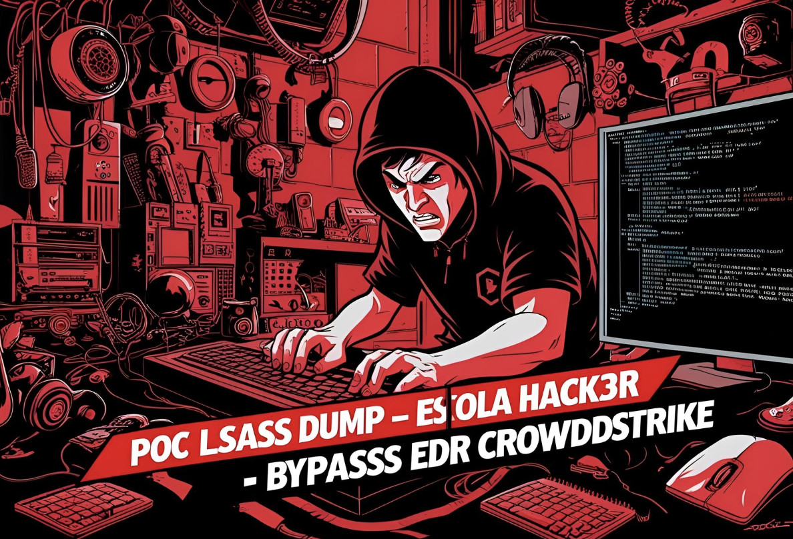
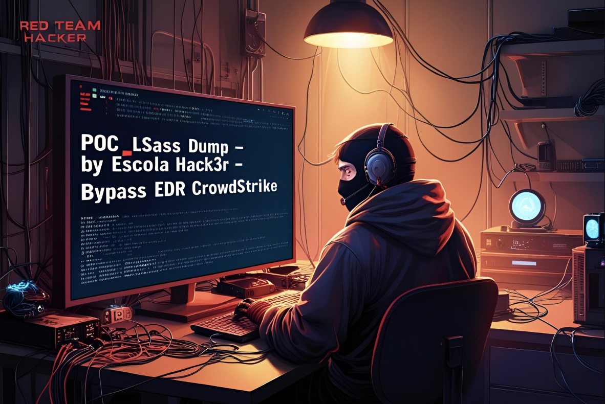
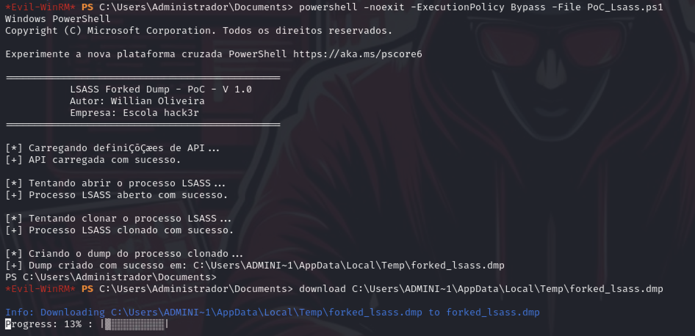

# Análise Técnica - "LSASS Forked Dump - PoC"

Criar uma cópia (fork) do processo lsass.exe e gerar seu dump de memória sem interagir diretamente com o processo original, reduzindo a detecção por ferramentas defensivas essa técnica foi desenvolvida e testada em ambientes com "CrowdStrike", destaco que nessa PoC meu foco foi criar um processo simplificado onde o atacante pode capturar as cerdencias do dump sem ter acionamento do EDR, o CrowdStike e outros EDRs monitoram processos primcipais dificultando atividades de ganho de acesso, exfiltração e credential access.

**A técnica clona o LSASS em um novo processo via NtCreateProcessEx.**

**A maioria dos EDRs (como o CrowdStrike) monitora chamadas diretas ao LSASS ou à API MiniDumpWriteDump no contexto do LSASS original.**

**Ao executar o dump sobre o clone, o processo malicioso escapa da detecção comportamental padrão.**

**Não há criação de alertas durante testes com CrowdStrike em modo de proteção total (Prevent Mode).**

# Descrição do Cenário

O cenário onde a PoC foi feita inclui acesso remoto dentro do ambiente sem ter a necessidade de acesso direto por rdp ou contato direto com o dispositivo nessa PoC foi utilizado Evil-WinRM e Powershell em ambiente Windows com CrowdStrike ativo, o script pode ser modificado e adequado para outros cenários.

# A História do Ataque Silencioso – LSASS Forked Dump vs. CrowdStrike ----> contém humor.

Era um dia chuvoso no laboratório da Escola Hack3r. O operador Red Team “wtechsec” acabava de receber uma missão: simular o acesso inicial a um servidor Windows corporativo protegido por CrowdStrike e extrair credenciais sem acionar nenhum alarme.

Após semanas estudando o comportamento dos sensores do Falcon, wtechsec sabia que qualquer tentativa direta de acessar a memória do LSASS causaria alerta imediato. Mimikatz, procdump, Pypykatz – tudo já estava na lista negra do EDR. Mas ele tinha um plano...

Conectando-se via **Evil-WinRM**, wtechsec ganhou acesso ao servidor como um administrador local comprometido:

No silêncio da sessão remota, wtechsec carregou sua criação: um script PowerShell artesanal, que clonava o processo LSASS usando a obscura syscall NtCreateProcessEx. O plano era simples e engenhoso:
**Clonar o LSASS para um novo processo fora da vigilância direta do CrowdStrike.**
**Realizar o dump nesse clone com MiniDumpWriteDump, escapando dos ganchos e alertas comportamentais.**

O script rodou. Nenhum alerta. Nenhum bloqueio. Apenas um dump limpo, salvo em **C:\Users\Public\forked_lsass.dmp.**

wtechsec sorriu. Ele sabia o que tinha em mãos. Um bypass real, discreto e funcional. O dump foi exfiltrado com calma. Ao analisá-lo localmente com o Mimikatz, ele recuperou as credenciais de domínio de um administrador sênior.
O domínio era dele.

**E o CrowdStrike? Silencioso como a noite.**

# Requesitos de Ataque
- Credencial de local admin ou com permissionamento equivalente.
- Usar Winrm - EvilWinrm, Powershell remote, ou reverse shell, dependendo do nivel de comprometimento do alvo e orquestração.
- Alvo Windos,10,11, até versões server.
- CrowdStrike ativo no alvo ou outro EDR monitorando processo e bloqueando dump manual.
- Máquina atacante com pypykats, evil-winrm, netexec e editor de texto para editar o script caso precise.
  

# Etapas do ataque.

### 1. Acesso Inicial
- O atacante utiliza o Evil-WinRM para se conectar remotamente ao host comprometido:

### 2. Upload do PoC_Lsass.PS1
- O atacante envia o script PowerShell da PoC (LSASS Forked Dump):

### 3. Execução Lsass_Forke.PS1
- O atacante executa o script via sessão remota com Evil-Winrm:

### 4. Dump Gerado
- Um dump do processo clonado do LSASS é criado em:

### 5. Exfiltração
- O dump pode ser baixado via WinRM para posterior análise em ferramentas como pypykatz: pypykatz-0.6.11 pypykatz-0.6.6 versão que os dumps foram testados.

  #### Tutorial em video ###

